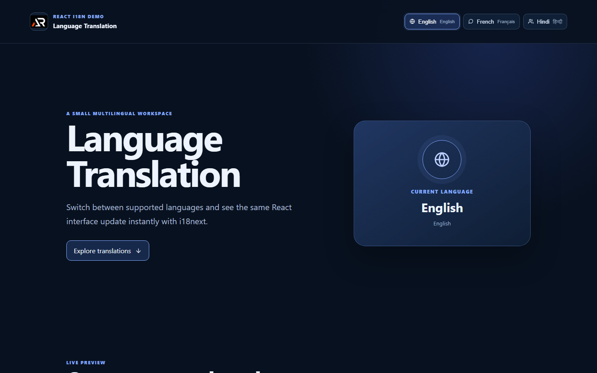

# Language Translation

A responsive React translation workspace that demonstrates language switching with i18next. The interface updates English, French, and Hindi content without leaving the page.

## Features

- English, French, and Hindi locale switching
- Browser and local storage language detection
- Reusable translation keys with name interpolation
- Fixed responsive header with mobile language menu
- Accessible icon-only footer links and go-to-top control
- GitHub Pages-ready production build

## Tech Stack

- React and Create React App
- i18next, react-i18next, and i18next HTTP backend
- react-icons
- CSS

## Run Locally

~~~bash
npm install
npm start
~~~

Build and preview the production bundle:

~~~bash
npm run build
npm run deploy
~~~

Live URL: https://a2rp.github.io/language-translation/

## Future Direction

The locale structure can grow into a complete multilingual content system with more languages and translated feature sections.

## Links

- Portfolio: [https://www.ashishranjan.net](https://www.ashishranjan.net)
- GitHub: [https://github.com/a2rp](https://github.com/a2rp)
- CodePen: [https://codepen.io/ash1198](https://codepen.io/ash1198)
- LinkedIn: [https://www.linkedin.com/in/aashishranjan](https://www.linkedin.com/in/aashishranjan)
- Facebook: [https://www.facebook.com/theash.ashish/](https://www.facebook.com/theash.ashish/)
- YouTube: [https://www.youtube.com/@ashishranjan-ashz?sub_confirmation=1](https://www.youtube.com/@ashishranjan-ashz?sub_confirmation=1)
- Email: [ash.ranjan09@gmail.com](mailto:ash.ranjan09@gmail.com)

## Support

- Support: [https://a2rp-donation-page.netlify.app/](https://a2rp-donation-page.netlify.app/)
- Buy Me A Coffee: [https://buymeacoffee.com/a2rp](https://buymeacoffee.com/a2rp)
- Patreon: [https://patreon.com/a2rp](https://patreon.com/a2rp)